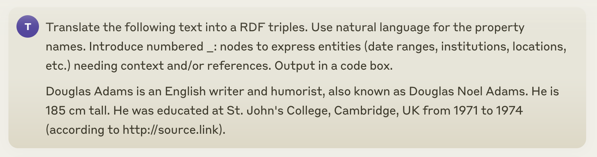
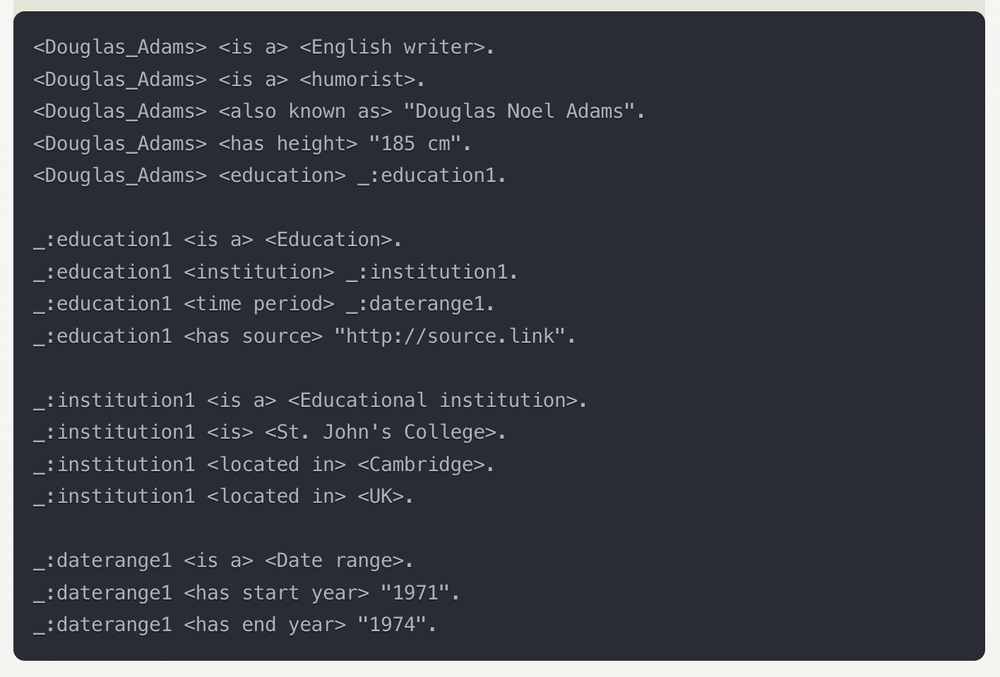
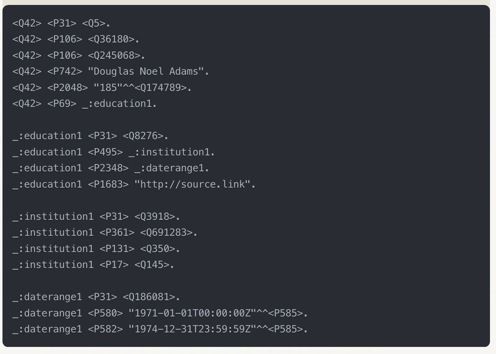

## What do we actually want?

- high quality/accuracy conversions of traditional documents
- high accuracy information extraction
- retrieval, summarization, etc.
- conversion as input to LLM training
- conversion as input to LLM inference

## LLMs and Noise

- traditional NLP was fragile: grammar, ambiguities, etc.
- LLMs are robust to noise in training data and questions
- robustness to OCR errors can be enhanced by augmenting training data with OCR errors
- redundancy of training data likely partially responsible (facts are represented many times)

## LLMs and Noise (2)

- OCR is also used for LLM input, e.g.:
  - data extraction from financial documents
  - question answering from biomed papers
- high accuracy (e.g., correct numbers) much more important
- LLMs may still have some robustness to layout errors
- LLM-related semantic errors may dominate
  - VQA performance may be limited by LLM performance
  - that's why so-so "OCR-free" CER may be acceptable

## Where do we stand?

- traditional OCR _may_ be adequate for both training and inference of LLMs
- "OCR-free" VQA _may_ have advantages because it can refer to visual content
- transformer based OCR system have not yet clearly demonstrated superior performance
- very high accuracy OCR (image $\rightarrow$ markup) still needed

## HTML Microdata / Microformats

```html
  <div itemscope itemtype="http://xbrl.org/TotalRevenue">
      <span>Total Revenue: </span>
      <span itemprop="amount" content="1300000000">$1.3 bn</span>
      <meta itemprop="currency" content="USD">
  </div>
```

- seamless embedding of metadata in HTML
- easy to implement, easy to make consistent
- common standards (XBRL)
- example of high quality semantic embedding
- also a good _target_ format for OCR systems (hOCR)

## The PDF Disaster

PDF has been disastrous from the point of view of moving to a paperless society:

- originated (via PS) as a printer page language
- most documents have no reading order, layout information
- huge variety of actual PDF file contents for the same appearance
- almost no semantic information standards
- the few that exist simply embed XML along with the PDF
- not even LaTeX generates tagged PDF by default
- Word is not much better, but at least has reading order


## Benchmarking Tasks and Model Coverage

| Task                     | DocILE | HierText | DUDE  |
|--------------------------|--------|----------|-------|
| Information Localization | ✓      |          |       |
| Information Extraction   | ✓      |          | ✓     | 
| Document Classification  |        | ✓        | ✓     |
| Semantic Role Labeling   |        | ✓        |       |
| Coreference Resolution   |        | ✓        |       | 
| Question Answering       |        |          | ✓     |
| Summarization            |        |          | ✓     |
| Multi-turn Dialogue      |        |          | ✓     | 

## Efficiency of Natural Language

Facts like the above translate efficiently back and forth between English and
knowledge representation languages:

```
Douglas Adams is an English writer and humorist, also known as Douglas Noel Adams.
He is 185 cm tall. He was educated at St. John's College, Cambridge, UK from 1971 to 1974
(according to http://source.link).
```

## Existing LLMs Already Understand Knowledge Representations



## Existing LLMs Already Understand Knowledge Representations (2)



## Existing LLMs Already Understand Knowledge Representations (3)




## Embedding Alignment

How it works:  
- Knowledge graph embeddings (vector representations of entities and relationships) are aligned with LLM embeddings during training. This alignment allows the LLM to better understand and integrate structured knowledge from graphs with natural language.

Interaction between LLM and Knowledge Graph:  
- The LLM uses the aligned embeddings to bridge the gap between structured knowledge and unstructured text. This improves performance on tasks like entity linking and relationship extraction.

Wang, X., et al. (2021). "KEPLER: A Unified Model for Knowledge Embedding and Pre-trained Language Representation." https://arxiv.org/abs/1911.06136

## Graph-based Reasoning

- LLM queries knowledge graph for relevant facts.
- Performs multi-hop reasoning to infer new information.
- Optionally uses logical inference rules.

E.g. Xiong, W., et al. (2020). "Answering Complex Open-Domain Questions with Multi-Hop Dense Retrieval." https://arxiv.org/abs/2009.12756

## SPARQL Query Generation for Knowledge Retrieval

How it works:  
- The LLM generates SPARQL queries to retrieve specific information from a knowledge graph. For example, a question like "What is the capital of France?" would lead the LLM to generate a SPARQL query such as:
  """
  SELECT ?capital WHERE {
    wd:Q142 wdt:P36 ?capital .
  }
  """
  This query retrieves the capital of France from the knowledge graph.

Interaction between LLM and Knowledge Graph:  
- The LLM generates SPARQL queries based on natural language input and retrieves information from the knowledge graph in real-time. This method leverages the structured nature of the knowledge graph for precise information retrieval during inference.

Sun, Z., et al. (2020). "Reasoning over Entity-Action-Relation Graphs for Open-Domain Question Answering." https://arxiv.org/abs/2012.15315

## Pre-training Data Augmentation

- Use large-scale knowledge graphs (e.g., Wikidata, Freebase).
- Convert triples into natural language statements.
- Integrate these statements into the pre-training corpus.
- Enhance model's knowledge of world facts.
- Improve understanding of entity relationships.

E.g. Petroni, F., et al. (2019). "Language Models as Knowledge Bases?" https://arxiv.org/abs/1909.01066

## Contextual Retrieval

- LLM retrieves facts from knowledge graph.
- Can be via SPARQL query generation or aligned embeddings.
- Enhances responses with dynamic data.
- Knowledge graph as information source.
- Improves output accuracy and relevance.

E.g., Guu, K., et al. (2020). "REALM: Retrieval-Augmented Language Model Pre-Training." https://arxiv.org/abs/2002.08909

# Users and Use Cases

## Example: Large Academic/Non-Profit Archives (<100 users)

- large collection of scanned books, articles, historical documents
- both pre-1924 and post-1924
- can't easily get digital data even when available
- requires very low error rates, high quality markup
- requires high quality image-based OCR

## Example: Biomedical Researcher (> $10^6$ users)

- collection of papers
- most native digital PDF (post 2000), some scanned
- wants to use LLMs to help with categorization, retrieval
- does not require high accuracy, just enough to do retrieval
- mix of approaches:
  - typical OCR for scanned docs (Tesseract is likely sufficient)
  - pdf2text tools for PDFs (occasional reading order problems acceptable)
  - also served by OCR-free VQA (but may be more expensive/slow)

## Example: Financial Data Services Provider (< 1000 users)

- large, steady influx of native digital PDFs
- typical, specialized layouts and contents
- approaches:
  - image-based OCR _undesirable_ because of potential for character errors
  - requires high throughput, low computational cost
  - use text from native digital PDF
  - combine with Transformer-based information extraction
  - fine tuned models for high domain specific performance
  - "OCR-free VQA" currently very far from meeting performance requirements

## Example: Companies Training Foundation Models (< 100 users)

- large collection of scanned materials (hopefully licensed)
- need large amounts of training data for LLMs
- LLM training is robust to character/layout errors
- information is redundant across many books
- approaches:
  - use an existing off-the-shelf OCR system
  - train a transformer-based OCR system
  - directly train a VQA model

  # Users, Use Cases, and Systems

- many use cases adequately taken care of by existing systems
  - low CER/WER, moderate IOU layout errors
- still needed, in development
  - very high accuracy end-to-end OCR
  - text from native digital, layout/semantics from transformers

  ## Different Types of Models

- Single Task Model -- trained for one specific tasks (e.g., image $\rightarrow$ text)
  - Examples: Tesseract, TrOCR, etc.
- Foundation Model -- trained for future fine-tuning on various tasks or new heads
  - Examples: LayoutLMv3
- Prompted Multimodal -- can be adapted to different tasks with different prompts
  - Examples: GPT-4o, Kosmos-2.5, etc.

