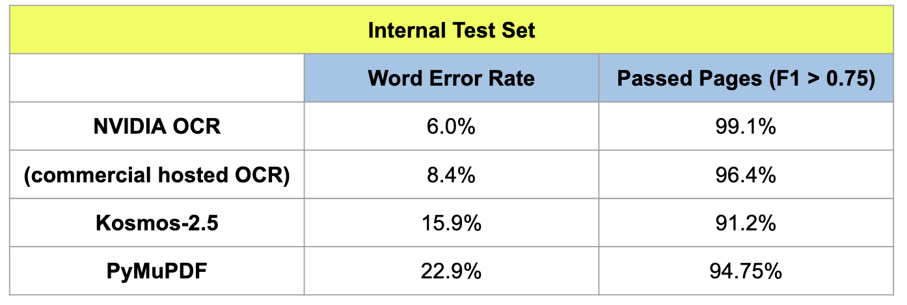

<!--
Notes:
-- llms for training quality evaluation, post-correction
-- vlms for image categorization, segmentation via backprop etc
-->

# Document Analysis in the time of LLMs

Thomas Breuel
NVIDIA Research

# Talk Outline

- AI Revolution
- Three Types of Document Analysis Systems
- Documents as Sources of Facts for LLMs

## REVOLUTION IN MACHINE LEARNING / AI

## LLMs / VLMs Have been Eating Machine Learning

- tasks that used to require extensive, specialized training...
- ... are now handled by foundation models
- ... or with minimal fine tuning

## Big Changes over the Last Decade

- broad, general models that work across many tasks and modalities
- very large scale unsupervised pretraining
- multitask training and multitask models
- efficient and simple fine-tuning on small datasets
- many problems solved with zero-shot or few-shot methods
- task specifications through natural language

## Zero/Few Shot with LLMs and VLMs

| LLMs                           | VLMs                          |
|--------------------------------|-------------------------------|
| Named Entity Recognition (NER) | Object Recognition/Classification |
| Document Categorization        | Object Detection              |
| Sentiment Analysis             | Scene Understanding           |
| Text Summarization             | Action Recognition            |
| Machine Translation            | ...                           |
| ...                            |                               |

## Example: Zero-Shot VLM Tasks

- "Is there a dog in the image?"
- "What is the bounding box for the dog in the image?"
- "How many balls are there in the image?"
- "Is Marylin Monroe in the picture?"
- "Caption the picture."
- "Is the picture in focus?"

## Example: Zero-Shot Document Classification

```Python
prompt = """
### Instructions

You are given the text of the first page of a PDF document. Please extract the title,
author, year, and abstract. Then assign a category to the document
from the following list of categories:

- ocr: text recognition, layout analysis, page segmentation
- handwriting: handwriting recognition, handwriting synthesis, etc.
- scene-text: text recognition in natural images and scenes
... more categories ...
- other: anything else

You must return only a JSON format dictionary with fields of
title, author, abstract, year, and category. Your output
will be parsed by machine.
"""

classifier = OpenAIClient(prompt)
result = classifier.json_query(text)
```

## Some Tasks Still Require Specialized Custom Models
(For now)

- Stereo -- two image input, specialized preprocessing
- Gaze Estimation -- high precision, specialized datasets
- Anomaly Detection -- specialized statistics
- 3D Pose Estimation for Articulated Objects -- complex structured outputs
- ...

# Current State of OCR

# Users & Use Cases

- Personal Library of Biomedical Researcher (>10⁶ users)
  - Digital PDFs, some scanned.
  - Use LLMs for categorization, retrieval; not high accuracy.
  - Combo of OCR, pdf2text, and existing LLMs adequate.

- Financial Data Services Provider (<1000 users)
  - Native digital PDFs; specialized layouts
  - Avoids image-based OCR, prefers text extraction
  - Mix of manual keying, OCR, digital formats; incremental improvements possible.

# Users & Use Cases (2)

- Large Academic/Non-Profit Archives (<100 users)
  - Large diverse collections of scanned docs
  - Requires low error, high quality markupt, reading order.
  - Often used by academics interested in the details of the text.
  - Not currently well-served.

- Companies Training Foundation Models (<100 users)
  - Large, scanned datasets for LLM training.
  - Unclear how much OCR errors affect LLM quality.

## "Traditional" OCR Pipeline


## OCR

- high accuracy scanned-to-text conversion
- fast on high resolution images
- $<0.5%$ character error
- substantial problems with reading order, logical layout :exclamation:
- ideally, recover markup (LaTeX, etc.)

## OCR + LLM


## OCR + LLM

- LLMs can solve many traditional retrieval and information extraction tasks
- LLMs are remarkably robust to OCR errors and layout errors
- LLMs also are good at OCR error correction ("correct the OCR errors in this text")
- combination of Traditional OCR + LLM works pretty well
- e.g. Tesseract + GPT-4o

## OCR + Multimodal Model

- substantial information is contained in the visual layout of documents
- traditional OCR systems are not very good at high level layout analysis

Examples: LayoutLMv3, UDOP, TILT, DocFormer, StrucText, ...

## OCR + Multimodal Model


## OCR + Multimodal Model

- OCR system can operate efficiently at high image resolutions
- multimodal model can handle layout analysis, reading order, etc.
- modularity of the system makes training, testing, and fine-tuning easier
- currently the most popular approach

## OCR-Free Approaches

- attempt to solve document understanding tasks without separate OCR step
- usually, a single transformer model performs both text recognition and layout analysis
- may perform full page recognition

Examples: Donut, DAN, TrOCR, ...

## OCR-Free


## Transformer-Based "Traditional" OCR

Most "OCR-free" transformers cannot perform full OCR. A few can:

- TrOCR (CER 2.89% handwriting only)
- UDOP (CER 2.56%, IOU 91.62%)
- Nougat (CER 25.5%)
- Kosmos 2.5 (CER 9.2%, IOU 82.1%)

Note:
- These are not particularly good results by OCR standards.
- Unknown how much is due to language modeling and even memorization.

## Current Benchmarks and Leaderboards

- text localization (receipts, etc)
- page segmentation and reading order (PubLayNet, PubTables-1M)
- visual question answering (VQA, DocVQA)
- key information extraction (KIE on SROIE)
- no widely used end-to-end OCR benchmarks

## NVIDIA OCR Efforts and Foundation Models

Ambitious all-in-one effort:

- VLMs that handle vision, scenes, and documents
- prompted responses
- document capabilities:
  - high accuracy image-to-text for books, articles
  - outputs logical and physical markup (headers, footnotes, etc.)
  - handles math and other special content
- massive training and data management effort due to generality of model

## NVIDIA Architecture


## NVIDIA Results



## What's Missing

- Need better end-to-end OCR benchmarks, not just task-specific benchmarks.
- Need more dense and diverse annotated dataset and benchmarks with complete annotation
- Better coverage (training+benchmarks) of mathematical equations, chemistry, etc.
- More diversity: different set of layout, languages, fonts, etc.
- Better coverage of uncommon layouts.

## OCR Future

- Two different OCR approaches (will likely co-exist):
  - High performance self-contained OCR as input to LLMs and multimodal models
  - Multimodal models that perform basic OCR/layout and invoke specialized agents.
- LLMs and VLMs help tremendously with training:
  - LLMs for data prepration, synthetic data, and quality evaluation
  - VLMs+multitask learning for dealing with variety of training datasets (DocVQA, text-to-html, text-to-LaTeX, etc.)

# What do we need OCR for?

## What do we still need OCR for?

- largely already converted (e.g. Gutenberg)
  - important pre-1924 books
  - important scientific papers
- good alternatives to OCR / good custom solutions
  - business, legal, government communications
  - scene text (camera based translation, self-driving cars, etc.)
- largely available in digital format
  - open source textbooks and other publications
  - scientific publications (tagged PDF/A will have large impact)

The "paperless future" is gradually happening...

## Higher-Level Purpose of OCR

<br>
<br>
<br>
<br>
<center>
<font size=48px>We are trying to obtain <em>facts</em></font>
</center>
<br>
<br>
<br>
<br>

## Types of Tasks involved in LLM Answers

- knowledge of facts ("Lincoln was president")
- knowledge of meta-facts ("this fact is true according to...")
- ability to reason ("Lincoln was a US citizen because he was president.")
  - reasoning can be imitated with factual knowledge
- ability to recall verbating ("please quote ...")

## MMLU Examples of Multiple-Choice Questions

### **Biology Example**: (fact, knowledge)
What is the powerhouse of the cell? 
(A) Nucleus (B) Mitochondria (C) Ribosome (D) Endoplasmic Reticulum

### **Mathematics Example**: (inference)
If 4 daps = 7 yaps, and 5 yaps = 3 baps, how many daps equal 42 baps? 
(A) 28 (B) 21 (C) 40 (D) 30

## What do Facts Look Like?

```YAML
wikidata_item:
  item_id: Q42  # Unique identifier
  labels: "Douglas Adams"  # Main name
  descriptions: "English writer and humorist"  # Short description
  aliases: ["Douglas Noël Adams"]  # Alternative names
  sitelinks: ["https://en.wikipedia.org/wiki/Douglas_Adams"]  # Wikipedia link

  statements:
    - property: Height
      property_id: P2048
      value: "185 cm"  # Simple property example
    
    - property: Educated at
      property_id: P69
      value: {item: "St John's College, Cambridge", item_id: Q691283}  # Statement pointing to another Q item
      qualifiers:
        - {qualifier: Start date, qualifier_id: P580, value: 1971}
        - {qualifier: End date, qualifier_id: P582, value: 1974}
      references:
        - {reference_property: Reference URL, reference_property_id: P854, value: "https://source.link"}  # Reference URL
```

## What do Facts Look Like?


## What do Facts Look Like?

```
<"Q42 (Douglas Adams)", "name", "Douglas Adams">
<"Q42 (Douglas Adams)", "alias", "Douglas Noel Adams">
<"Q42 (Douglas Adams)", "P31 (instance of)", "Q5 (human)">
<"Q42 (Douglas Adams)", "P22 (father)", "_:b0 (educational period)">
<"Q42 (Douglas Adams)", "P50 (author)", "Q148882 (The Hitchhiker's Guide to the Galaxy)">

<"_:b0 (educational period)", "startTime", "1971">
<"_:b0 (educational period)", "endTime", "1974">
<"_:b0 (educational period)", "P69 (educated at)", "Q131305 (St John's College, Cambridge)">
<"_:b0 (educational period)", "P31 (instance of)", "Q39562 (educational stage)">
<"_:b0 (educational period)", "P854 (reference URL)", "http://example/...">

<"Q131305 (St John's College, Cambridge)", "P27 (country)", "Q145 (United Kingdom)">
<"Q131305 (St John's College, Cambridge)", "P31 (instance of)", "Q3918 (college of the University of Cambridge)">

<"Q148882 (The Hitchhiker's Guide to the Galaxy)", "title", "The Hitchhiker's Guide to the Galaxy">
<"Q148882 (The Hitchhiker's Guide to the Galaxy)", "firstPublished", "1979">
<"Q148882 (The Hitchhiker's Guide to the Galaxy)", "P31 (instance of)", "Q7725634 (novel)">
```

## What do facts look like?

<br>
<br>
Douglas Adams, also known as Douglas Noel Adams, was a human. He authored the novel "The Hitchhiker's Guide to the Galaxy", first published in 1979. From 1971 to 1974, he was educated at St John's College, Cambridge, which is a college of the University of Cambridge in the United Kingdom. 
<br>
<br>

## Classical Problems with Symbolic AI

- term resolution
  - "Douglas Adams" - "Douglas Noel Adams"
- disambiguation
  - "John Smith (actor)" vs "John Smith (politician)"
- ontology mapping
  - Wikidata "educated at" vs. DBpedia "alma mater"
- LLMs are good at resolving these problems

## Facts and Documents

Documents can be understood as collections of facts:
- simple statements of facts ("Hydrogen is the lightest element")
- context-dependent facts ("Lincoln was president from 1861 to 1865")
- meta-facts ("According to ... Lincoln was president from 1861 to 1865")
- textual facts ("'Shall I compare thee to a summer's day?' is the first line of a sonnet by Shakespeare")

## A Statistical Model of Facts

Model:
- facts are distributed across texts in a power law distribution
- LLMs need to be exposed to each fact approximately $k$ times to learn it
- performance on fact-based benchmarks reflects the percentage of facts learned

Prediction:
- how long does it take to learn $x$% of facts in a corpus?

## Predictions of Learning Behavior


## Actual Observations

Scaling Laws for Neural Language Models


Kaplan et al. 2021

## Observations

- learning itself is a power law process
- the exponent of the power law is critical in determining learning time
- we can potentially achieve great improvements by achieving a more uniform distribution of facts

## Approaches to Achieving Uniform Fact Distribution

- machine learning approaches
  - use umbrella sampling of documents
  - use boosting
- data driven approaches
  - careful manual selection of training data (e.g., textbooks)
  - small LLMs + utilize facts directly during inference
  - train directly on facts instead of documents

# Summary

## State of OCR

- Traditional OCR: high text accuracy, layout issues
- Three approaches: OCR+LLM, OCR+VLM, OCR-free
- Likely will continue to co-exist: different strengths/weaknesses.
- High performance image-to-markup desirable for many applications.
- Need:
  - Improve coverage: diverse layouts, math, formulas, etc.
  - Better end-to-end OCR benchmarks

## State of Knowledge and Reasoning

- LLMs learn and reason from facts, and are benchmarked on facts
- OCR and document analysis crucial step in deriving facts from documents
- Making facts explicit helps with acquisition, testing, reasoning
- Power law governs learning efficiency
- Scaling laws crucial for fact acquisition
- Uniform fact distribution potentially improves learning